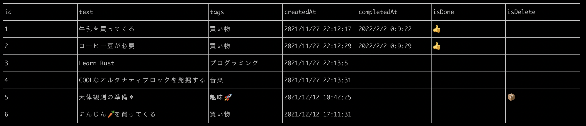

# deno_cli_todo

This is a CLI to-do tool created with Deno.

**This is still a project in development and does not yet have all the necessary
features.**

## Screenshot



## Usage

```
USAGE:
  ct [OPTIONS] <SUBCOMMAND>

FLAGS:
  -h, --help  Prints help information
  -v, --version Prints version information

OPTIONS:
  -f, --file <data-file> Use a different data file

SUBCOMMANDS:
  add     Write tasks to the data file (Ex: ct add helloworld(Task text))
  list    List all tasks in the data file (Ex: ct list)
  done    Done task (Ex: ct done 1(Task ID))
  edit    Edit task text (Ex: ct edit 1(Task ID) edittaskname(Fix text))
  edittag Edit tasks tag (Ex: ct edittag 1(Task ID) edittagname(New tag))
  delete  Delete task (Ex: ct delete 1(Task ID))
  help    Prints help information
```

## Build binary

```sh
deno compile --allow-read --allow-write --output ct cli.ts
```

## Licence

[MIT](https://github.com/shinshin86/deno_cli_todo/blob/main/LICENSE)

## Author

[Yuki Shindo](https://shinshin86.com)
